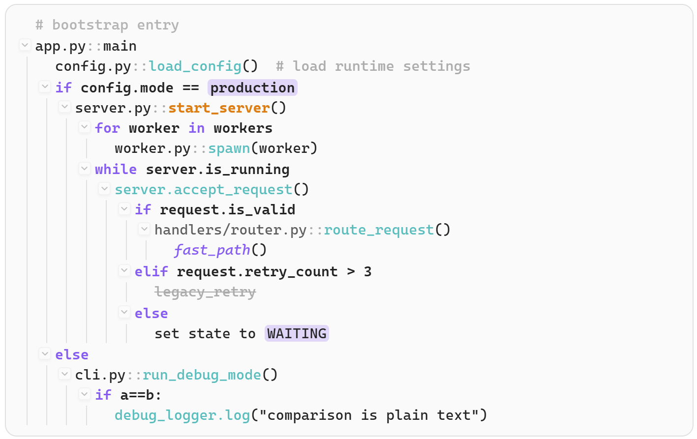

# Codeflow

An Obsidian plugin that renders `codeflow` fenced code blocks as a collapsible tree-shaped call graph and adds lightweight editor syntax highlighting for the same language.

## Current features

- Renders ```` ```codeflow ```` blocks as a compact call tree in reading view.
- Supports collapsible tree nodes with subtle chevron toggles.
- Adds editor syntax highlighting for `codeflow` fenced blocks.
- Supports inline markdown markers: `**bold**`, `*italic*`, `==highlight==`, and `~~strike~~`.
- Supports comments, `if / elif / else`, `for ... in ...`, and `while`.
- Supports `path/to/file.py::Class.method()` style scoped names.

## Rendering behavior

- Source lines typically start with `- ` to express call-tree nodes.
- In preview rendering, the leading `-` is hidden.
- Any extra whitespace immediately after that leading `-` is also removed in preview.
- Nodes with children are expanded by default.
- Click the chevron or double-click the line to collapse or expand a node.

Example source:

```codeflow
# bootstrap entry
- app.py::main
  - config.py::load_config()  # load runtime settings
  if config.mode == ==production==
    - server.py::**start_server**()
      for worker in workers
        - worker.py::spawn(worker)
      while server.is_running
        - server.accept_request()
          if request.is_valid
            - handlers/router.py::route_request()
              - *fast_path*()
          elif request.retry_count > 3
            - ~~legacy_retry~~
          else
            - set state to ==WAITING==
  else
    - cli.py::run_debug_mode()
      if a==b:
        - debug_logger.log("comparison is plain text")
```

The above code will be rendered as:



## Syntax summary

- Use `- ` lines for major call-chain nodes.
- Use indentation with spaces to create hierarchy.
- Use `# comment` or trailing `# comment` for comments.
- Use `if`, `elif`, `else`, `for ... in ...`, and `while` for control flow.
- Use inline markdown like `**bold**`, `*italic*`, `==highlight==`, and `~~strike~~` inside a line.
- `==highlight==` is only recognized at a safe boundary, so expressions like `if a==b:` are not treated as highlights.
- Full syntax guide: `docs/codeflow-syntax.md`

## Install for development

```bash
npm install
npm run build
```

Copy these files into your vault plugin folder:

- `main.js`
- `manifest.json`
- `styles.css`

Example target folder:

```text
<your-vault>/.obsidian/plugins/obsidian-codeflow/
```

## Build and package

- Build production bundle: `npm run build`
- Create release zip: `npm run package`
- Release artifacts are written to `release/`

## Release contents

The release zip contains only:

- `main.js`
- `manifest.json`
- `styles.css`
